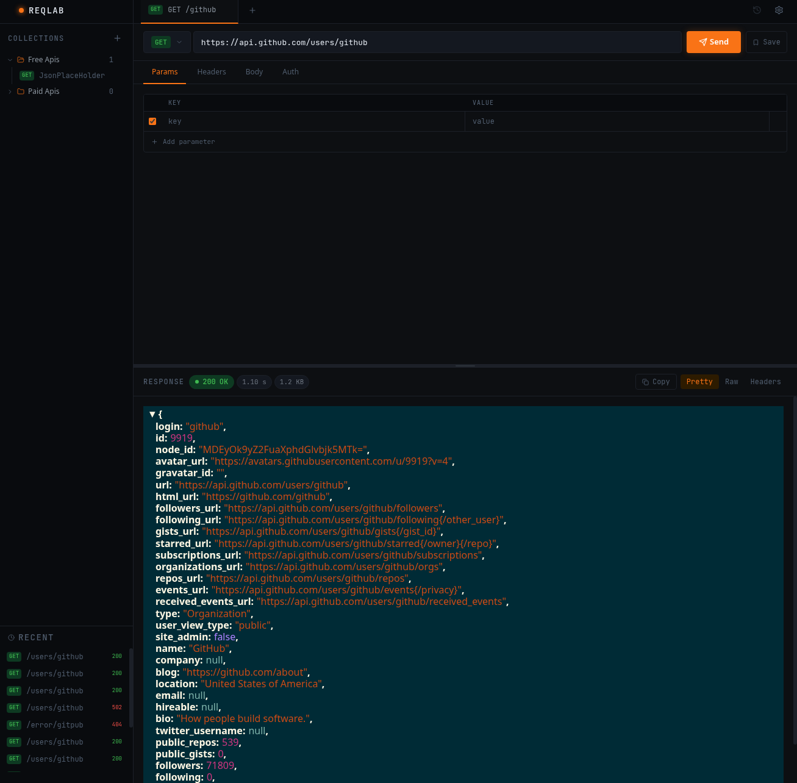
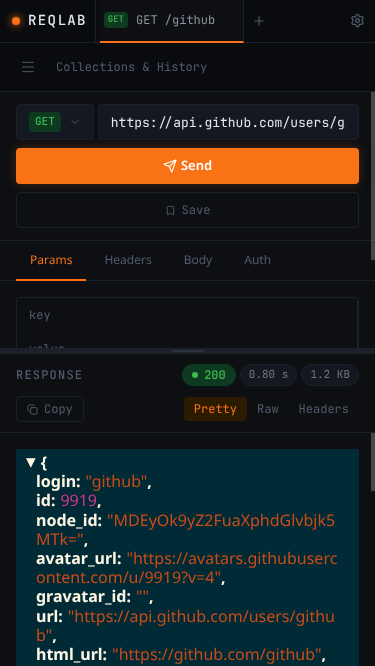
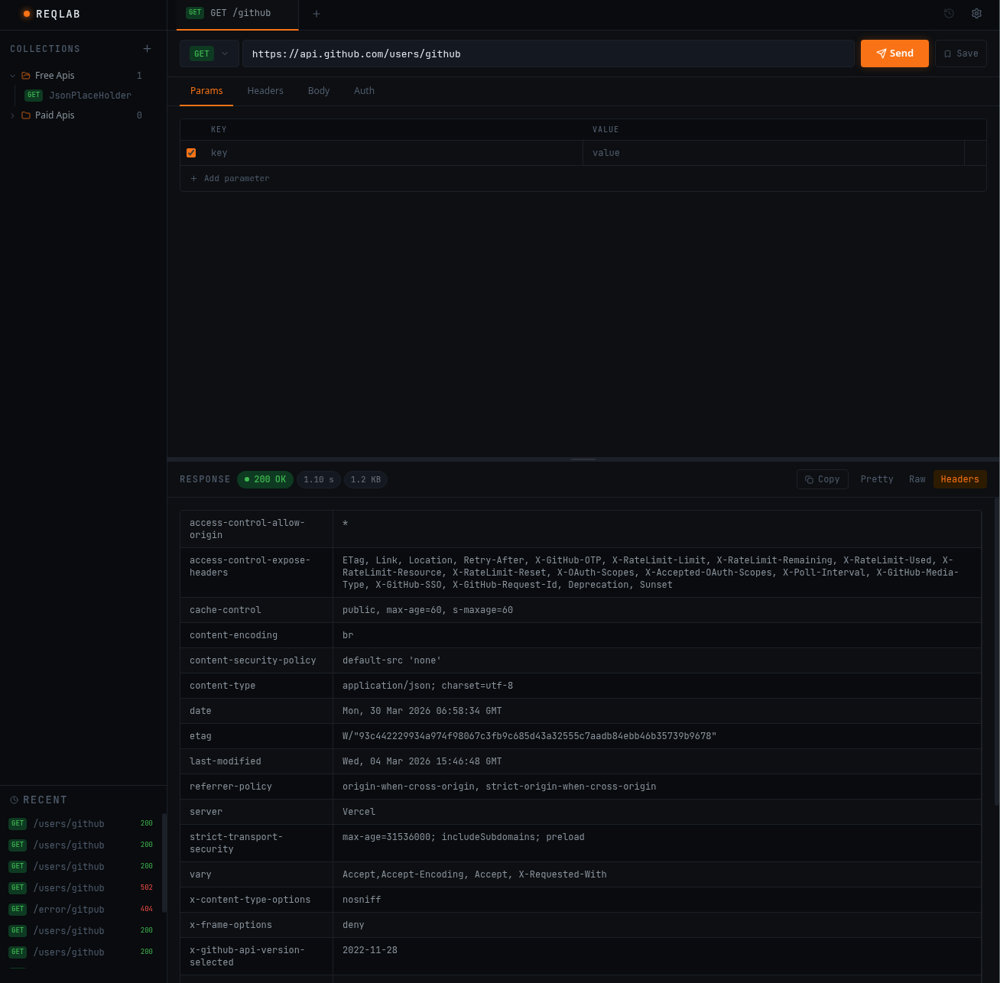
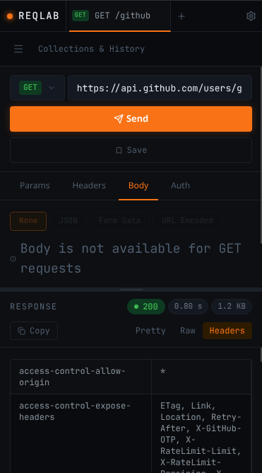
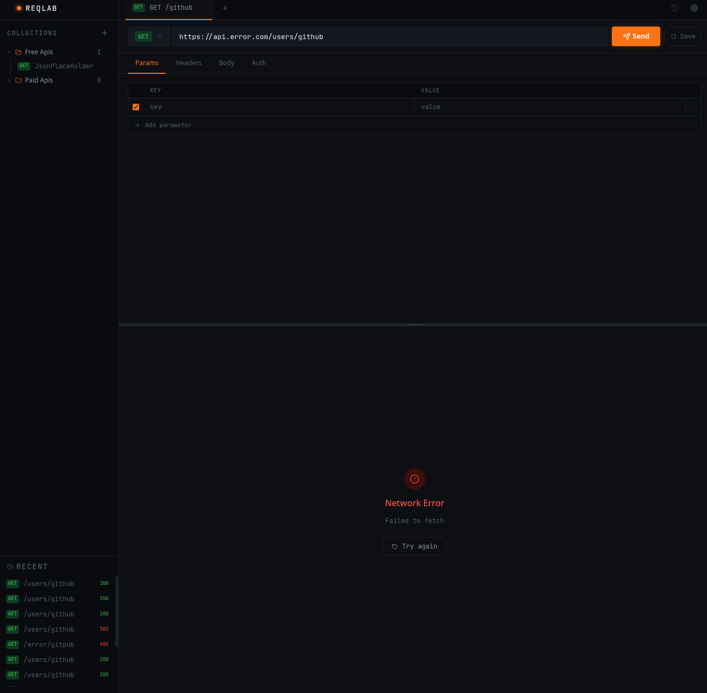
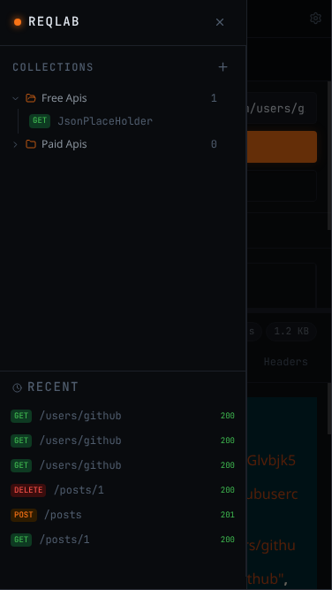

# ReqLab


A browser-based API testing client inspired by Postman.
Test HTTP endpoints, inspect responses, and organise requests
into collections directly from the browser.

**[Live version hosted on Vercel](https://req-lab.vercel.app/)**

## Features

- Send HTTP requests (GET, POST, PUT, PATCH, DELETE)
- Inspect responses with syntax-highlighted JSON, raw text, and headers
- Organise requests into named collections
- Browse recent request history
- Work across multiple tabs simultaneously
- Persist workspaces across sessions
- Bypasses CORS restrictions using a serverless proxy.

## Stack

| Category         | Tool                   | Reason                                                                   |
| ---------------- | ---------------------- | ------------------------------------------------------------------------ |
| Framework        | React 18 + TypeScript  | —                                                                        |
| Build            | Vite                   | Fast HMR and native ESM                                                  |
| Styling          | Tailwind CSS           | CSS-first config, works well in a component based project                |
| UI state         | Zustand                | Lightweight and no boilerplate                                           |
| Async state      | Custom hook + fetch    | For user-triggered single use requests                                   |
| Resizable panels | react-resizable-panels | For split screen between request and response                            |
| JSON viewer      | react-json-view-lite   | Pretty printing json in the response panel                               |
| Deployment       | Vercel                 | For deployment and also provides serverless functions to get around CORS |

## Application Previews

|                           **Desktop**                            |                   **Mobile View (375 x 667)**                   |
| :--------------------------------------------------------------: | :-------------------------------------------------------------: |
|    |    |
|                           **Headers**                            |                           **Headers**                           |
|  |  |
|                        **Network Error**                         |                           **Sidebar**                           |
|        |      |

## Running locally

Requires Node 18+ and the Vercel CLI for the proxy to work
in development.

```bash
# Install Vercel CLI globally
npm install -g vercel

# Clone and install
git clone https://github.com/vilnout/ReqLab.git
cd reqlab
npm install

# Start development server
vercel dev
```

The app runs on `localhost:3000`.
The proxy function runs on `localhost:3000/api/proxy`.

Alternatively `npm run dev` starts the Vite
server on port 5173 but the proxy function won't be available.
Direct requests to CORS-permissive APIs like JSONPlaceholder
will still work. Toggle the proxy off in settings to make direct requests.

## Known limitations

- Collections are stored in localStorage which is browser-bound,
  single-device and cleared with browser data
- Auth tab UI exists for requests but OAuth flows are not implemented
- No user authentication
